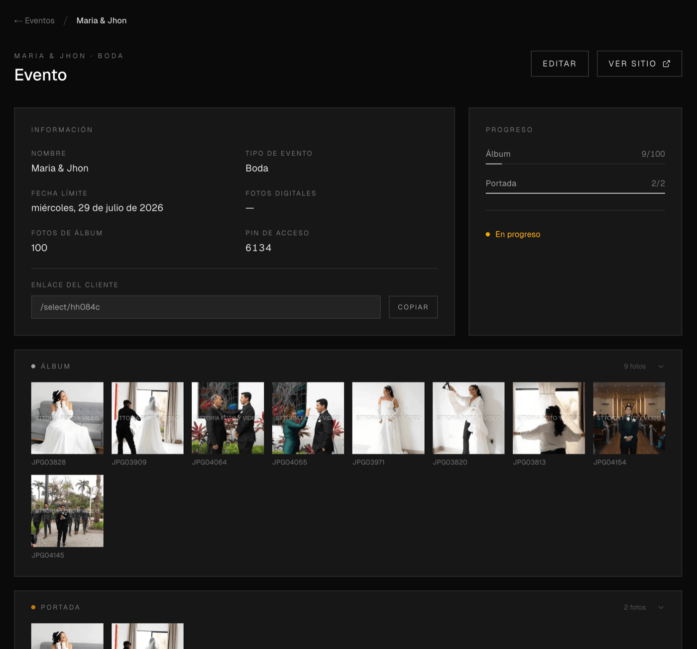

# Picselectr

A photo delivery and client-selection tool for photographers. Clients get a unique, PIN-protected link to browse their event photos and choose which ones they want delivered — digital files, album prints, and album cover — while photographers manage everything from a private admin dashboard.

Built solo, end-to-end: schema design, auth, file storage, image processing, and transactional email.

**[Live demo](#) · [Screenshots](#screenshots)** <!-- add links when available -->

## Screenshots

<!-- Drop 2-4 images/GIFs here — admin dashboard, client selection grid, full-screen preview modal.
Recruiters skim; a visual is worth more than a paragraph. -->

|                    Admin dashboard                    |                  Client selection view                  |
| :-----------------------------------------------------: | :--------------------------------------------------------: |
|  |  |

## Why this project

Photographers currently manage client photo selections over WhatsApp, email threads, or shared drive folders — slow, error-prone, and impossible to enforce package limits (e.g. "choose 30 digital photos, 15 for the album, 2 for the cover"). Picselectr replaces that with a single shareable link and automatic tier limits, cascading deselection, and a completion email the moment a client finishes.

## Features

### Client-facing

- **Unique selection link** — Each event gets a shareable `/select/[slug]` URL protected by a PIN
- **Three-tier photo selection** with enforced limits per event — Digital → Album → Cover, each a subset of the last
- **Cascading rules** — Removing a digital photo automatically removes it from album and cover, keeping selections consistent
- **Full-screen preview modal** with selection controls
- **Mobile-first responsive grid**, built for clients selecting from their phone

### Admin dashboard (`/events`)

- **Event management** — Create, view, and delete events (wedding, birthday, quinceañera, photobooth, etc.)
- **Photo uploads** directly from the dashboard, with automatic thumbnail generation
- **Live selection review** — See exactly what a client picked, per tier, as they pick it
- **One-click shareable links** with PIN protection
- **Deadline tracking** per event
- **Automatic email notification** the moment a client completes their selection, listing every photo chosen per tier

## Architecture

```
Client Browser                Admin (photographer)
      │                              │
      ▼                              ▼
┌─────────────────────────────────────────────┐
│              Next.js App Router              │
│   /select/[slug]           /events/[slug]     │
│   (public, PIN-gated)      (auth-protected)   │
└───────────────┬───────────────┬───────────────┘
                │               │
        ┌───────▼──────┐ ┌──────▼───────┐
        │   Supabase    │ │  Cloudflare  │
        │ Postgres+RLS  │ │  R2 (photos) │
        │  + Auth       │ │ via sharp    │
        └───────┬───────┘ │ (thumbnails) │
                │         └──────────────┘
        ┌───────▼───────┐
        │  Resend API   │
        │ (email on     │
        │  completion)  │
        └───────────────┘
```

- **Auth & session refresh** handled in [`middleware.ts`](middleware.ts) via Supabase SSR cookies — every request to `/events/*` is gated server-side, no client-side auth flicker.
- **Storage**: original + thumbnail variants are generated with `sharp` on upload ([`app/api/upload/route.ts`](app/api/upload/route.ts)) and streamed to Cloudflare R2 via the S3-compatible SDK ([`lib/r2.ts`](lib/r2.ts)) — no vendor lock-in to AWS.
- **Data access**: selection state and event data are read/written through Supabase with row-level security, so client-facing PIN routes and the authenticated admin dashboard share one Postgres instance safely.
- **Notifications**: completion emails are fire-and-forget (a failed send never blocks a client's save) and built with a plain `fetch` call to Resend's API — no SDK dependency for a single endpoint ([`app/events/store.ts`](app/events/store.ts)).

## Tech stack

| Layer          | Choice                                          |
| -------------- | ------------------------------------------------ |
| Framework      | [Next.js 16](https://nextjs.org/) (App Router, Server Actions) |
| Language       | TypeScript                                      |
| UI             | React 19, Tailwind CSS v4                       |
| Database/Auth  | Supabase (Postgres, Row-Level Security, Auth)   |
| File storage   | Cloudflare R2 (S3-compatible, via `@aws-sdk/client-s3`) |
| Image processing | `sharp` (server-side thumbnailing)            |
| Email          | Resend                                          |
| Package manager | pnpm                                            |

## Getting started

```bash
pnpm install
cp .env.example .env.local   # fill in Supabase, R2, and Resend credentials
pnpm dev
```

### Environment variables

| Variable | Purpose |
| --- | --- |
| `NEXT_PUBLIC_SUPABASE_URL` / `NEXT_PUBLIC_SUPABASE_ANON_KEY` | Supabase project connection |
| `SUPABASE_SERVICE_ROLE_KEY` | Server-side privileged Supabase access (uploads, admin lookups) |
| `CLOUDFLARE_R2_ENDPOINT` / `CLOUDFLARE_R2_ACCESS_KEY_ID` / `CLOUDFLARE_R2_SECRET_ACCESS_KEY` / `CLOUDFLARE_R2_BUCKET_NAME` / `R2_PUBLIC_URL` | Photo storage |
| `RESEND_API_KEY` / `RESEND_FROM_EMAIL` | Completion email notifications (optional — silently skipped if unset) |

```bash
pnpm lint     # ESLint
pnpm build    # Production build
```

## Roadmap

- [ ] Automated test coverage (unit + e2e)
- [ ] Bulk photo download for photographers
- [ ] Multi-language support (currently Spanish-first copy)

## About

Built by [Ernesto Aviles](https://github.com/Eavilesz) — feel free to reach out at ernesto-av@hotmail.com.
